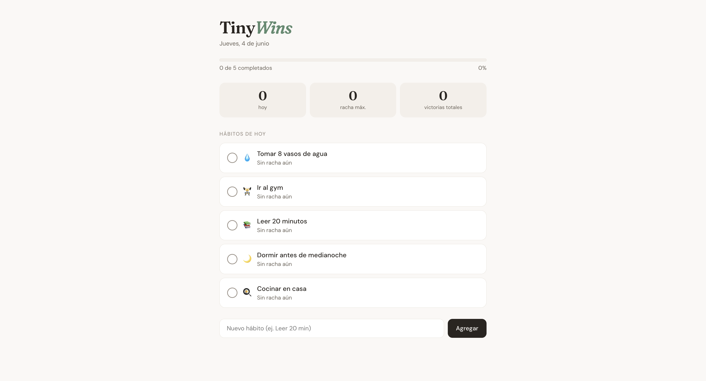
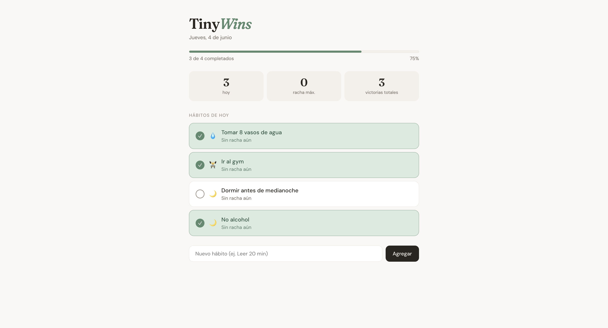

# TinyWins 🏆

Convierte acciones pequeñas en progreso visible. TinyWins es una mini herramienta de productividad para registrar hábitos diarios y celebrar cada victoria del día.




## ¿Qué hace?

- Registra hábitos personales diarios (tomar agua, leer, gym, etc.)
- Marca hábitos como completados con un clic
- Muestra progreso visual con barra y porcentaje
- Lleva racha de días consecutivos por hábito
- Persiste los datos en localStorage (sobrevive recargas)
- Resetea automáticamente cada día y actualiza rachas

## Tecnologías

- React 19
- Vite
- JavaScript (ES6+)
- CSS con custom properties
- localStorage para persistencia

## Estructura del proyecto
src/
├── components/
│   ├── Header.jsx        # Título y fecha actual
│   ├── ProgressBar.jsx   # Barra de progreso del día
│   ├── HabitList.jsx     # Lista de hábitos
│   ├── HabitItem.jsx     # Hábito individual
│   └── AddHabitForm.jsx  # Formulario para agregar hábitos
├── hooks/
│   └── useHabits.js      # Lógica de estado y persistencia
├── utils/
│   └── storage.js        # Capa de acceso a localStorage
├── App.jsx
└── index.css

## Decisiones técnicas

**Custom hook `useHabits`**: toda la lógica de estado vive separada de los componentes. Los componentes solo renderizan — no saben nada de localStorage ni de cómo se calculan las rachas.

**Capa `storage.js`**: el acceso a localStorage está aislado en un solo archivo. Si en el futuro se cambia a una API externa, solo se modifica este archivo.

**Estado derivado**: `doneCount`, `progressPct` y similares se calculan en cada render en lugar de guardarse en el estado. Menos cosas que sincronizar, menos bugs posibles.

## Correr el proyecto localmente

```bash
git clone https://github.com/flacoprogrammer/tinywins.git
cd tinywins
npm install
npm run dev
```

Abre [http://localhost:5173](http://localhost:5173) en tu navegador.

## Autor

Fabian Fuentes — [GitHub](https://github.com/flacoprogrammer)